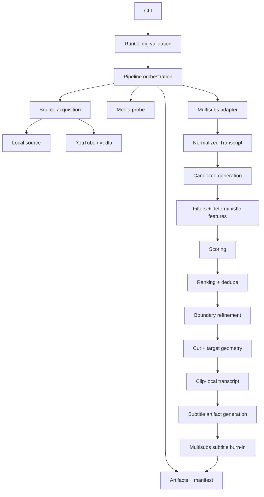

# Architecture

**Project:** `multicuts`  
**Status:** MVP architecture  
**Last reviewed:** 2026-09-11

## 1. Purpose

This document defines the implementation architecture for `multicuts`.

The architecture intentionally favors a small synchronous Python application with explicit data flow and narrow external-tool boundaries. The project should remain easy to understand, test, and change without introducing infrastructure that is not required by the MVP.

The main architectural goals are:

- transcribe a source video only once;
- keep candidate generation, scoring, and ranking independent from media tools;
- isolate `multisubs`, yt-dlp, FFmpeg, and semantic-model integrations;
- make expensive stages resumable through persisted artifacts;
- keep subtitle composition tied to the final clip geometry;
- preserve enough metadata to reproduce a run;
- make the default test suite fast and hermetic;
- avoid framework-style dependency injection, plugin registries, event buses, databases, queues, and distributed execution.

## 2. Architectural principles

### 2.1 One pipeline, one source video

The MVP processes one source video per invocation.

The pipeline is synchronous. A single orchestration path should be preferred over a graph engine, task scheduler, worker system, or generic pipeline framework.

### 2.2 Domain logic does not know third-party tools

Candidate generation, filtering, feature extraction, scoring composition, ranking, and boundary refinement operate on project-owned models.

They must not depend directly on:

- yt-dlp objects;
- WhisperX objects;
- `multisubs` private models;
- FFmpeg command syntax;
- provider-specific LLM responses.

### 2.3 Adapters are narrow

An adapter exists only where the project crosses an external boundary.

Adapters should:

- translate project-owned inputs into provider calls;
- validate/normalize provider outputs;
- translate provider errors into project errors;
- avoid leaking provider-specific objects into domain code.

Do not create interfaces for ordinary internal modules that have only one straightforward implementation.

### 2.4 Persist expensive results, not arbitrary state

The MVP persists artifacts that make expensive work reusable:

- acquired-source metadata;
- normalized transcript;
- candidate/scoring results;
- run manifest;
- final clips.

A database is not required. JSON files inside a run workspace are sufficient.

### 2.5 Final geometry owns subtitle layout

Subtitle wrapping and positioning must be generated against the final clip geometry.

For vertical clips, the correct sequence is conceptually:

```text
source video
    |
    v
select candidate
    |
    v
cut + crop/resize to final 9:16 geometry
    |
    v
build clip-local subtitle timeline
    |
    v
generate subtitle artifacts for final geometry
    |
    v
burn subtitles
```

Reusing an ASS file generated for the source geometry is not valid when the target geometry differs.

### 2.6 Prefer direct code over generic abstractions

A small function is preferred to a class when no state or external contract is involved.

A concrete module is preferred to:

- service locators;
- dependency-injection containers;
- abstract base classes with one implementation;
- generic repositories;
- command buses;
- event buses;
- home-grown plugin systems.

`Protocol` is appropriate for real external boundaries that are expected to have multiple implementations, such as semantic scoring.

## 3. Technology baseline

### Runtime

- Python `>=3.10,<3.14`;
- FFmpeg;
- ffprobe;
- `multisubs >=4.3,<5`;
- yt-dlp.

During early implementation, the runtime dependency pins the official
`multisubs[whisperx]` 4.3.0 wheel for reproducibility. The extra preserves the
current WhisperX backend now that `multisubs` packages ASR runtimes separately.

### Development

- pytest;
- Ruff;
- Pyright;
- standard Python packaging through `pyproject.toml`.

Additional runtime dependencies should be added only when they remove meaningful complexity or are required by a provider.

## 4. High-level architecture



## 5. Package structure

The initial implementation should stay close to this structure:

```text
multicuts/
├── pyproject.toml
├── README.md
├── AGENTS.md
├── docs/
│   ├── architecture.md
│   ├── conventions.md
│   └── prd.md
├── src/
│   └── multicuts/
│       ├── __init__.py
│       ├── cli.py
│       ├── config.py
│       ├── errors.py
│       ├── models.py
│       ├── pipeline.py
│       ├── artifacts.py
│       ├── media.py
│       ├── adapters/
│       │   ├── multisubs.py
│       │   ├── youtube.py
│       │   └── scoring.py
│       ├── candidates/
│       │   ├── generator.py
│       │   ├── filters.py
│       │   ├── features.py
│       │   └── ranking.py
│       └── rendering/
│           ├── cutter.py
│           └── subtitles.py
└── tests/
    ├── unit/
    ├── contract/
    └── integration/
```

This layout is a guideline, not a requirement to create every file immediately.

Create a module only when it has a concrete responsibility. It is acceptable to keep related behavior in one file until separation improves clarity.

## 6. Module responsibilities

### `cli.py`

Owns the console boundary.

Responsibilities:

- parse arguments;
- convert CLI values into `RunConfig`;
- invoke the pipeline;
- print concise progress/results;
- map project exceptions to exit codes.

It must not contain:

- candidate-generation rules;
- scoring logic;
- FFmpeg command construction;
- provider-specific parsing.

### `config.py`

Owns validated run configuration.

A single `RunConfig` should capture user-visible options needed by the pipeline.

Prefer immutable configuration after validation.

Validation should happen before expensive work whenever possible.

Examples:

- duration limits are valid;
- `clips > 0`;
- `0 <= min_score <= 100`;
- output geometry options are compatible;
- template directory exists when supplied;
- provider/model names are syntactically valid.

Provider availability that requires invoking external tools belongs at the adapter/media boundary, not in pure config parsing.

### `errors.py`

Owns the project exception hierarchy.

Keep it small:

```text
MulticutsError
├── ConfigurationError
├── AcquisitionError
├── MediaError
├── TranscriptionError
├── ScoringError
├── RenderingError
└── ArtifactError
```

Add a new error type only if callers need to react differently.

External exceptions should be wrapped at adapter boundaries while preserving the original cause with exception chaining.

### `models.py`

Owns small project data structures shared across stages.

Likely models:

```text
AcquiredSource
MediaInfo
Transcript
TranscriptSegment
Word
Candidate
CandidateFeatures
ChecklistResult
ScoreResult
SelectedClip
ClipTranscript
RenderConfig
RunManifest
```

Guidelines:

- prefer `dataclass` for internal value objects;
- use enums only for closed sets with behavior/validation value;
- avoid deep inheritance;
- avoid generic `dict[str, Any]` after provider normalization;
- store timestamps as seconds using `float` unless a concrete precision problem requires another representation.

Provider response models belong in adapters and should be converted immediately.

### `pipeline.py`

Owns orchestration only.

The pipeline should read approximately like the product flow:

```python
source = acquire_source(...)
media = probe_media(source)
transcript = load_or_transcribe(...)
candidates = generate_candidates(transcript, config)
scored = evaluate_candidates(candidates, transcript, config)
selected = select_candidates(scored, config)
clips = render_selected_clips(selected, source, transcript, config)
publish_manifest(...)
```

The exact function names may differ, but the orchestration should remain readable at this level.

The pipeline should not implement the algorithms it coordinates.

### `artifacts.py`

Owns the filesystem contract for a run.

Responsibilities:

- run/workspace directories;
- artifact paths;
- JSON serialization;
- source/transcript/scoring cache metadata;
- safe publication;
- temporary-file cleanup;
- collision handling.

This module is intentionally filesystem-based. Do not introduce a repository abstraction or database for the MVP.

### `media.py`

Owns generic media inspection shared by acquisition/rendering.

Responsibilities may include:

- checking FFmpeg/ffprobe availability;
- probing streams;
- duration;
- rotation;
- final presentation dimensions;
- audio presence.

Keep subprocess execution narrow and use argument vectors, never shell command strings.

If responsibilities become too large later, split by demonstrated need.

## 7. External adapters

### 7.1 `adapters/youtube.py`

Wraps yt-dlp.

Responsibilities:

- recognize/handle supported remote sources;
- configure a controlled download destination;
- return `AcquiredSource`;
- preserve safe metadata such as source ID/title/URL;
- translate yt-dlp failures into `AcquisitionError`;
- never log cookies, tokens, or authentication values.

Prefer the yt-dlp Python API over constructing shell commands because yt-dlp is already a Python dependency.

The rest of the project should only receive the downloaded local path and normalized metadata.

### 7.2 `adapters/multisubs.py`

Wraps the public `multisubs` contract.

Initial responsibilities:

- call `generate_transcriptions(...)`;
- support explicit language or automatic detection;
- parse the generated JSON;
- normalize it into `Transcript`;
- call the supported subtitle-artifact API when available;
- call `embed_subtitles(...)`;
- expose `multisubs` version in run provenance;
- translate provider failures into project errors.

Restrictions:

- do not import `multisubs.transcriber`, `multisubs.ass`, `multisubs.layout`, `multisubs.animation`, or other private implementation modules;
- do not expose `multisubs` model objects to domain code;
- do not retranscribe every selected clip.

### `multisubs` subtitle-artifact gap

The desired per-clip flow requires a public capability that can build ASS from existing clip-local transcript/cue data for the final clip geometry.

Until that API is available:

- keep the gap isolated inside `MultisubsAdapter`;
- do not copy the `multisubs` renderer into this project;
- do not make private `multisubs` imports part of the architecture;
- if necessary, evolve the public `multisubs` API first.

### 7.3 `adapters/scoring.py`

The scoring boundary is the one place where a small protocol is justified because the MVP may support deterministic, remote, or hybrid scoring.

Conceptual interface:

```python
class SemanticScorer(Protocol):
    def score(
        self,
        candidate: Candidate,
        context: ScoringContext,
    ) -> SemanticScore:
        ...
```

The provider returns semantic judgments, not the authoritative final score.

Final score composition and deterministic penalties remain project-owned behavior.

This prevents provider changes from silently changing core scoring rules.

The initial remote boundary uses the OpenAI Responses API with structured
output. It is optional, reads its credential only from `OPENAI_API_KEY`, sends
bounded transcript text and derived features, and requests `store=false`.
`gpt-6-luna` with reasoning effort `max` is the initial configured model.
Heuristic scoring remains the default local route; a fully local semantic model
is outside the MVP.

## 8. Candidate subsystem

### `candidates/generator.py`

Builds candidate windows from the normalized transcript.

Inputs:

- transcript;
- configured duration limits.

Signals may include:

- sentence boundaries;
- pauses;
- punctuation;
- aligned words;
- language-aware boundaries already represented by normalized segments.

The generator should not call an LLM.

Avoid brute-forcing arbitrary timestamp windows. Generate candidates from meaningful transcript boundaries.

### `candidates/filters.py`

Runs cheap structural checks before expensive scoring.

Examples:

- duration;
- speech amount;
- excessive silence when data is available;
- obvious incomplete boundaries;
- transcript quality constraints.

Rules return explicit outcomes:

```text
PASS
SOFT_FAIL
HARD_FAIL
UNKNOWN
```

### `candidates/features.py`

Computes deterministic data reused by scoring and ranking.

Examples:

- duration;
- words per second;
- pause ratios;
- filler indicators;
- opening/ending boundary quality;
- transcript confidence aggregates.

Do not compute features merely because they might be useful someday. Add features when a rule, score, or evaluation uses them.

### `candidates/ranking.py`

Owns:

- deterministic score composition;
- penalties;
- score clamping;
- temporal overlap;
- top-K selection;
- redundancy control;
- deterministic tie-breaking.

Semantic scoring may feed this module, but provider-specific logic must not live here.

## 9. Scoring architecture

The MVP score has two layers:

```text
deterministic features + semantic judgments
                    |
                    v
             score composition
                    |
                    v
        deterministic penalties
                    |
                    v
             final 0..100 score
```

The final score must be explainable.

Persist:

- dimension scores;
- applied penalties;
- final score;
- confidence;
- reason;
- scoring algorithm version;
- provider/model information when used.

### Failure behavior

If a semantic provider fails:

1. perform only bounded retries appropriate to the provider;
2. persist/emit a warning;
3. use a heuristic fallback only when explicitly supported;
4. never fabricate a provider response.

A single candidate scoring failure should not necessarily abort the complete run if other candidates can still be evaluated safely.

## 10. Boundary refinement

Boundary refinement runs only after candidate selection.

Its job is to make final media cuts cleaner without materially changing the selected semantic content.

Prefer nearby:

- first-word starts;
- last-word ends;
- pauses;
- sentence/clause boundaries.

Keep the search window small.

If refinement changes the text span enough to alter the meaning or payoff, the candidate must be rescored or rejected rather than silently publishing a different clip.

## 11. Rendering architecture

### 11.1 Raw clip rendering

`rendering/cutter.py` owns:

- accurate source trimming;
- center crop for `9:16`;
- resize;
- audio/video mapping;
- temporary output;
- publication of the unsubtitled final-geometry clip.

Use FFmpeg through a narrow helper.

Do not optimize for stream-copy if it makes boundaries or geometry inconsistent.

### 11.2 Clip-local transcript

Before subtitle generation:

1. take words/segments inside the refined source interval;
2. shift timestamps so the clip starts at `0`;
3. clamp values to clip duration;
4. preserve source indexes/metadata needed for traceability;
5. never invent word timestamps.

This produces a `ClipTranscript`.

### 11.3 Subtitle rendering

`rendering/subtitles.py` coordinates the subtitle presentation through `MultisubsAdapter`.

Inputs:

- raw final-geometry clip;
- `ClipTranscript`;
- selected template;
- optional custom template directory.

Outputs:

- subtitle artifacts needed for diagnostics/reuse;
- final hard-subtitled video.

The supported multisubs 4.3 CLI consumes versioned timed-cue JSON and the raw clip, probes that clip's geometry, and publishes SRT, ASS, and a rendered video together. The adapter owns the JSON translation and validates the output set. Each cue requires exact text-to-word mapping and complete observed word times; missing word timing fails clearly rather than triggering ASR or fabricated alignment.

## 12. Workspace and artifacts

A run uses one output directory and a private working area.

Conceptual layout:

```text
multicuts-output/
└── <source-stem>/
    ├── manifest.json
    ├── source/
    │   └── metadata.json
    ├── transcript/
    │   └── transcript.json
    ├── candidates/
    │   └── candidates.json
    ├── clips/
    │   ├── 001-score-91.mp4
    │   ├── 001-score-91.json
    │   └── ...
    └── .work/
        └── temporary artifacts
```

Rules:

- final outputs are never written directly while still incomplete;
- render to a temporary path, then publish atomically where possible;
- existing completed outputs are not overwritten silently;
- successful runs may remove disposable `.work` artifacts;
- `--keep-intermediates` may retain useful diagnostics;
- caches are keyed by source fingerprint, stage version, and relevant config.

## 13. Cache strategy

The MVP cache is artifact-based, not service-based.

### Transcription cache key

Must include at least:

```text
source fingerprint
transcription provider/version
model
requested language/auto mode
task
transcription schema/stage version
```

### Scoring cache key

Must include at least:

```text
candidate identity
scoring algorithm version
weights/thresholds
semantic provider/model
prompt version when applicable
```

### Rendering cache key

Must include at least:

```text
selected source interval
target geometry
subtitle template/config
renderer/provider versions
```

Changing subtitle style must not invalidate transcription.

Changing target geometry must not invalidate scoring.

No generalized cache framework is needed; stage-specific metadata is easier to reason about.

## 14. Error handling

Errors are handled at the layer that has enough context to explain them.

Example:

```text
yt-dlp exception
    -> AcquisitionError

multisubs/WhisperX failure
    -> TranscriptionError

invalid semantic response
    -> ScoringError or candidate-level warning

FFmpeg render failure
    -> RenderingError
```

Rules:

- preserve the original exception as `__cause__`;
- messages should include the operation and safe resource name;
- do not include credentials or full secret-bearing commands;
- do not catch `Exception` broadly except at genuine external boundaries or the CLI top level;
- `KeyboardInterrupt` should allow cleanup and propagate to the CLI for a clean interrupted exit.

## 15. Dependency direction

Allowed direction:

```text
cli
 |
 v
pipeline
 |
 +--> domain modules (models, candidates)
 |
 +--> rendering coordination
 |
 +--> adapters
 |
 v
external libraries/tools
```

Domain modules must not import the CLI or adapters.

Adapters may import domain models to return normalized values.

Avoid circular imports by keeping shared data models simple and dependency-free.

## 16. State and side effects

Pure or mostly pure functions are preferred for:

- candidate generation;
- feature extraction;
- filter rules;
- overlap calculation;
- score composition;
- ranking;
- timestamp shifting.

Side effects should concentrate in:

- acquisition;
- transcription provider calls;
- FFmpeg execution;
- semantic-provider calls;
- artifact persistence.

This separation is the primary testability mechanism. No DI framework is required.

## 17. Testing architecture

The default test suite must be hermetic and fast.

### Unit tests

Test pure domain behavior without invoking:

- FFmpeg;
- yt-dlp;
- WhisperX;
- remote scorers.

Use real project models and small transcript fixtures.

### Contract tests

Verify assumptions at external boundaries, especially:

- `multisubs` public API;
- normalized `multisubs` JSON fields consumed by the adapter;
- semantic scorer structured output;
- yt-dlp adapter behavior against controlled fixtures where possible.

### Integration tests

Opt-in tests may require:

- local FFmpeg/ffprobe;
- a small video fixture;
- real subtitle burn-in;
- real vertical rendering;
- selected `multisubs` template behavior;
- real transcription only when explicitly marked because model loading is expensive.

Do not mock internal implementation details merely to increase coverage.

## 18. Performance constraints

The architecture should naturally avoid unnecessary expensive work:

- validate before loading transcription models;
- transcribe once;
- filter before semantic scoring;
- score only a bounded candidate set;
- render only selected clips;
- reuse persisted artifacts when configuration permits.

No parallel-processing framework is required for the MVP.

If performance later becomes insufficient, measure first and optimize the stage proven to be the bottleneck.

## 19. Security and privacy

- local media stays local unless the user configures a remote service that explicitly requires data;
- remote semantic scoring should receive text/features, not raw video by default;
- never log secrets, yt-dlp cookies, tokens, or authorization headers;
- avoid `shell=True`;
- treat filenames and provider text as untrusted input when building commands;
- control all temporary/output directories;
- do not implement DRM or access-control bypasses.

## 20. What not to build for the MVP

Do not introduce the following without a concrete requirement:

- database;
- ORM;
- Redis;
- task queue;
- worker pool;
- event bus;
- message broker;
- plugin registry;
- dependency-injection container;
- repository/service layers around simple filesystem operations;
- asynchronous pipeline;
- microservices;
- distributed processing;
- generic workflow engine;
- custom media abstraction over FFmpeg beyond the narrow operations required;
- duplicate subtitle styling/rendering engine;
- custom virality ML training pipeline.

The architecture should grow only when a real use case makes the current direct design insufficient.
